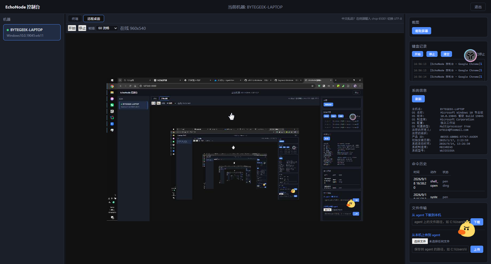

# EchoNode

一个简单的远程集群控制工具

支持win+~~linux~~（linux将在后续提供支持目前linux只完成了命令行远程和部分远程桌面的适配）

win客户端仅1.8MB


## 编译
使用 CMake 构建 `server`：
```bash
cmake --build cmake-build-debug --target server --parallel 14
```
如果已经进入项目根目录，直接执行即可。
### Windows / MinGW
```bash
cmake --build G:\code\EchoNode\cmake-build-debug --target server --parallel 14
```
> `--parallel 14` 表示使用 14 个并行任务进行编译，可根据 CPU 核心数调整。
示使用 14 个并行任务进行编译，可根据 CPU 核心数调整。
## 运行
### Server
编译完成后启动 Server：
```shell
server.exe
```
Server 启动后会生成一个 **Key**，例如：
```text
Key: 0798fbc5-b519-4b61-839e-2c00d65f1f80
```
记下该 Key，启动 Client 时需要使用。
### Client
使用 Server 生成的 Key 连接：
```cshell
echonode_agent.exe ws://127.0.0.1:8080/agent 0798fbc5-b519-4b61-839e-2c00d65f1f80
```
其中：
```text
ws://127.0.0.1:8080/agent    Server WebSocket 地址
0798fbc5-...                  Server 生成的 Key
```

### 进程
```client/CMakeLists.txt:78``` 的 ```-mwindows``` 让 exe 变成 GUI 子系统程序，PowerShell 启动后不等待，立刻返回提示符

如果 Server 部署在其他机器，将 `127.0.0.1` 替换为 Server 的实际 IP 或域名即可。
